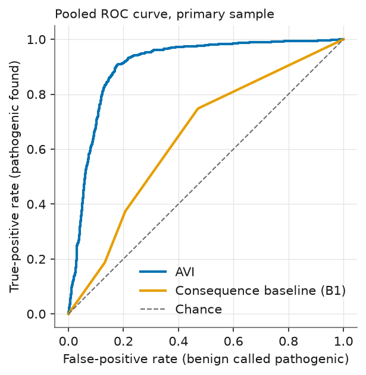
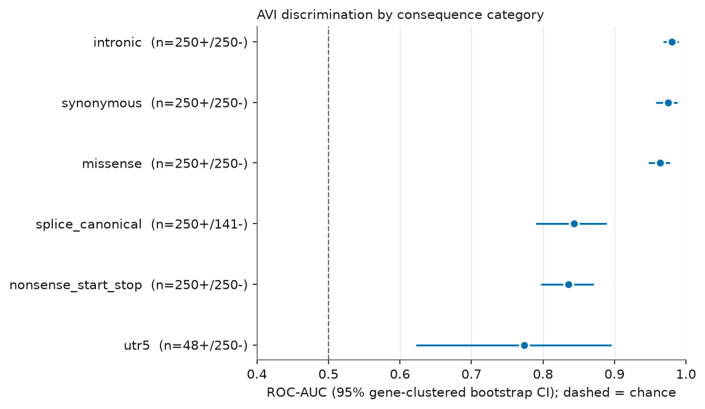
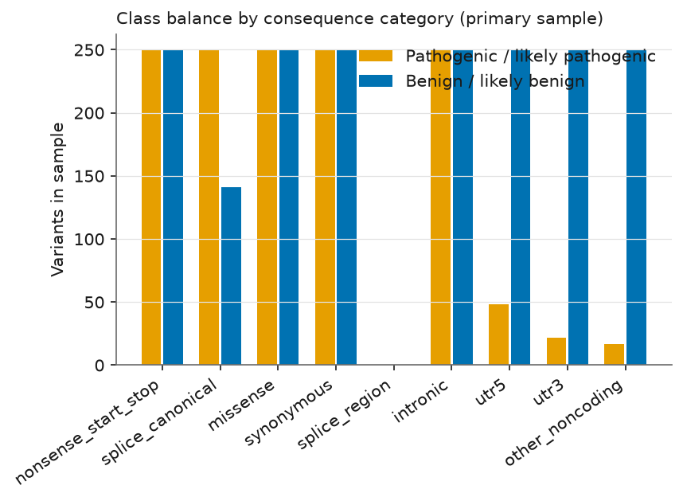

# How well does the AlphaGenome Variant Impact (AVI) score separate pathogenic from benign human genetic variants? An independent evaluation on ClinVar

**Atharv Ranjan** — Independent researcher, no institutional affiliation  
Preprint, 4 October 2026. Not peer reviewed.  
Cite as: Ranjan A. (2026). Zenodo. doi:10.5281/zenodo.23134413

> **Research use only. This work makes no clinical or diagnostic claims and is not medical advice.** The AVI score and the other AlphaGenome outputs analysed here are for theoretical modelling; they are not intended, validated or approved for clinical use.

## Abstract

**Background.** The AlphaGenome Atlas provides a precomputed AlphaGenome Variant Impact (AVI) score for every possible single-nucleotide variant (SNV) in the human genome. Its developers report strong performance for separating pathogenic from benign ClinVar variants. **Aim.** We evaluated AVI independently on a reproducible, pre-specified sample of ClinVar SNVs. **Methods.** From the ClinVar GRCh38 VCF (file dated 28 September 2026) we sampled 3,228 SNVs with ≥2-star review status (1,337 pathogenic or likely pathogenic, 1,891 benign or likely benign), stratified by molecular consequence and capped at 10 variants per gene per class and category, retrieved their AVI scores from the Atlas API, and computed ROC-AUC and PR-AUC with gene-clustered bootstrap 95% confidence intervals. **Results.** In this sample, pooled ROC-AUC was 0.905 (0.892–0.917) and PR-AUC 0.817 (0.784–0.848); a fixed consequence-type ranking alone reached 0.644. The macro-average over categories with at least 30 variants of each class was 0.895 (0.867–0.918). ROC-AUC was highest for missense (0.963), synonymous (0.975) and intronic (0.980) variants, and lower for canonical splice sites (0.844), nonsense/start/stop variants (0.836) and 5′ UTR variants (0.774). In the synonymous and intronic categories, most pathogenic variants lay close to exon boundaries, so those categories are probably easier than a random sample of such variants would be. **Conclusions.** AVI separated the two ClinVar classes well in this sample, but ClinVar-specific confounds and possible information overlap with ClinVar (which we cannot exclude) limit what can be concluded; the results are not evidence of clinical utility.

## 1. Introduction

Most human genetic variation lies outside protein-coding sequence (about 98% according to [2]), and predicting which variants disrupt function is a central open problem in genetics. AlphaGenome is a deep-learning model from Google DeepMind that predicts many functional genomic signals from DNA sequence and can score the effect of a variant on them [1]. The AlphaGenome Atlas [2] precomputes these scores for roughly 9 billion possible SNVs in the human reference genome (GRCh38) and combines them with protein-level and conservation features into a single supervised score, the **AlphaGenome Variant Impact (AVI) score**. According to the Atlas preprint, AVI was trained to separate observed human variants with a filtering allele frequency above versus below 0.1% (proxy neutral versus proxy impactful variants), not to predict ClinVar labels, and was then benchmarked, among other datasets, on ClinVar [2].

ClinVar is NCBI's public archive of clinical-laboratory and researcher assertions about the significance of variants [3]. Distinguishing pathogenic from benign ClinVar variants is a common benchmark for variant-effect predictors, but it is also easy to over-interpret: ClinVar labels are not experimental ground truth, they are unevenly distributed across genes and consequence types, and a predictor may have seen related information during development.

Independent evaluation matters because the developers of a score have both the most knowledge and the strongest incentive to present it favourably, and because choices such as which review-status filter, which variant types and which sampling to use can change reported performance. Here a sampling and analysis plan was written and frozen before any score was retrieved (`design.md` in the code repository), and every later change is logged. This paper reports one independent researcher's replication on a fresh sample, with an emphasis on how performance varies by variant category and on what could inflate it.

*Related work.* We rely on the sources listed in the References. The AlphaGenome paper [1], the Atlas preprint [2], the terms, the API documentation and the ClinVar and GENCODE documentation pages were read directly; the ClinVar article in [3] is cited as it appears in the reference list of [1] and was not itself opened. The Atlas preprint [2] reports AVI performance on ClinVar as area under the precision-recall curve (AUPRC) at ClinVar's natural class balance, stratified by consequence category. Our sample is deliberately close to class-balanced within categories, so its PR-AUC values are **not comparable** to those figures and we make no direct comparison with them. We did not evaluate any other predictor.

## 2. Data and methods

### 2.1 Pre-registration and deviations
The design (variant source, label rules, sample size, metrics, baselines, confound checks) was fixed in `design.md` before any AVI score was retrieved. Seven dated deviations were then logged; numbers 1–5 were recorded before any AVI score was retrieved and numbers 6–7 after the results had been seen: (1) the ClinVar file was `clinvar_20260928.vcf.gz`, because ClinVar's GRCh38 VCFs are dated roughly weekly and no 1 October file existed; (2) the ≥1-star sensitivity analysis uses the primary sample plus a small supplementary sample of exactly-1-star variants, to stay under the API-call cap; (3) the gene used for capping and clustering is the first symbol in ClinVar's `GENEINFO` field; (4) ClinVar's consequence field contains no splice-region term, so that planned category is empty, and variants with no consequence annotation were excluded; (5) three non-coding categories contain few pathogenic variants (see Results); (6) after the pre-specified sanity gate flagged AUC > 0.97 in two categories, exploratory diagnostics were run; (7) one of those diagnostics used GENCODE exon annotations. Deviations 6 and 7 are **exploratory and not pre-registered**.

### 2.2 Variants and labels
We used the ClinVar GRCh38 VCF `clinvar_20260928.vcf.gz` (MD5 `707723f0a08d1d711eb1c1de660a9098`, downloaded from NCBI). Only SNVs on chromosomes 1–22 and X were kept. A variant was **positive** if its aggregate germline classification was exactly Pathogenic, Likely pathogenic or Pathogenic/Likely pathogenic, and **negative** if exactly Benign, Likely benign or Benign/Likely benign. Variants of uncertain significance, conflicting classifications, risk factor, drug response, low-penetrance terms, or any record mixing classes were excluded. ClinVar's *review status* (a 0–4 star rating of how well-supported a classification is) was required to be ≥2 stars (several submitters in agreement, an expert panel, or a practice guideline) for the primary analysis, because single-submitter assertions are the noisiest.

| Step | Variants remaining |
|---|---|
| raw VCF data rows | 4,555,206 |
| single-nucleotide variants | 4,235,234 |
| on chr1-22 or X | 4,231,506 |
| clean pathogenic-type or benign-type label | 1,525,987 |
| recognised review status and >=1 star | 1,477,790 |
| [primary] review status >= 2 stars | 396,770 |
| [primary] mapped to a consequence stratum | 394,703 |
| [primary] final sample | 3,228 |
| [onestar] final sample | 887 |

*Table 1. Number of variants remaining after each filtering step (from `results/attrition.csv`).*

### 2.3 Consequence categories and sampling
Each variant was assigned a molecular-consequence category from the Sequence Ontology terms in ClinVar's `MC` field, using a fixed priority order: nonsense/start-lost/stop-lost; canonical splice donor/acceptor; missense; synonymous; intronic; 5′ UTR; 3′ UTR; other non-coding. (Frameshift and other non-SNV types do not occur here. ClinVar's `MC` field contained no splice-region term, so that planned category is empty; 2,067 otherwise eligible variants with no consequence annotation were excluded.) For each category and class we drew a random sample (fixed seed 20261004) of up to 250 variants after capping at 10 variants per gene, giving 3,228 primary variants. A supplementary sample of up to 60 variants per class and category of exactly-1-star variants (887 variants) was used only for a sensitivity analysis. Each variant was also flagged by whether it lies on a chromosome that AVI used neither for training nor for validation (3, 6, 9, 12, 16, 18, 19, 21; from the Atlas preprint's Methods).

### 2.4 Scores
For each sampled variant we requested the scorers `AVI_SCORE` and `AVI_SCORE_FEATURE_IMPORTANCE` from the AlphaGenome Atlas API (Python package `alphagenome` 0.9.0) using GRCh38 coordinates and 1-based positions. The primary score is the raw AVI score; higher means more predicted impact. The API also returns a quantile, from which we computed a PHRED-scaled value (−10·log10(1 − quantile); not checked against the Atlas website in this study). The feature breakdown gives each of 18 input features' additive contribution to the score. We grouped these into the AlphaMissense contribution and the sum of the ten AlphaGenome-derived contributions. Across all 4,115 scored variants, the raw score minus the sum of the 18 contributions averaged -0.049 (range -0.102 to -0.012), so the contributions do not sum exactly to the raw score and we treat them as ranking scores, not an exact decomposition. 4,115 of 4,115 requested variants were scored and 0 errors were logged; responses were cached on disk, requests were limited to 4 concurrent workers with backoff, and a hard cap of 6,000 attempts was enforced (4115 used).

### 2.5 Metrics and statistics
**ROC-AUC** is the probability that a randomly chosen pathogenic variant receives a higher score than a randomly chosen benign one (0.5 is chance, 1.0 is perfect). **PR-AUC** (average precision) measures how enriched the top-ranked variants are for pathogenic ones; its chance level equals the share of pathogenic variants, which we report next to every value. Confidence intervals are 95% percentile intervals from a bootstrap of 2,000 replicates that **resamples genes, not variants**, because variants within a gene are not independent. A category receives an AUC only if it has at least 30 variants of each class; otherwise it is described but not scored. The macro-average is the unweighted mean of the eligible categories' ROC-AUCs. No model was trained or fitted on any AlphaGenome output; only rank-based metrics and counts were computed.

### 2.6 Baseline and secondary analyses
*Baseline B1* is a fixed ordinal ranking by consequence type (nonsense/start/stop 5 > canonical splice 4 > missense 3 > synonymous 1 > all non-coding 0; fixed before scoring and never tuned). *Decomposition*: AUC of the AlphaMissense contribution alone and of the AlphaGenome-derived contributions alone. *Held-out chromosomes*: the primary analysis restricted to chromosomes AVI did not train or validate on. *Sensitivity*: primary sample plus 1-star variants. *Fixed thresholds*: sensitivity and specificity at PHRED 10, 20 and 30. *Leave-top-genes-out*: the five most frequent genes removed. We did not evaluate other predictors, so **no comparison with any other method is made**.

### 2.7 Exploratory diagnostics (not pre-registered)
After the sanity gate (pooled AUC outside [0.55, 0.97] or any category AUC above 0.97) flagged two categories, we (a) re-derived AUCs with scikit-learn and re-read 300 sampled variants from the raw ClinVar file, (b) ran a within-category label-shuffle null, (c) computed single-feature AUCs, (d) split variants by whether ClinVar lists a population allele frequency (ExAC, 1000 Genomes or ESP), and (e) computed each variant's distance to the nearest exon edge using GENCODE release 46 (basic set, GRCh38) in the bands 0–2, 3–10, 11–50, 51–200 and >200 bp, with AUC reported where each class had at least 10 variants.

### 2.8 Reproducibility
Code, design, tests and the list of sampled ClinVar variants are in the repository (Section 8). Python 3.12.12, pandas 3.0.6, numpy 2.5.3, scikit-learn 1.9.1; random seed 20261004.

## 3. Results

### 3.1 Overall and by category
| Category | Pathogenic / benign | ROC-AUC (95% CI) | PR-AUC (95% CI) | Share pathogenic |
|---|---|---|---|---|
| Missense | 250 / 250 | 0.963 (0.947–0.977) | 0.965 (0.946–0.980) | 0.50 |
| Synonymous | 250 / 250 | 0.975 (0.958–0.988) | 0.983 (0.971–0.991) | 0.50 |
| Nonsense / start-lost / stop-lost | 250 / 250 | 0.836 (0.797–0.871) | 0.792 (0.728–0.854) | 0.50 |
| Canonical splice site (±1–2 bp) | 250 / 141 | 0.844 (0.790–0.889) | 0.849 (0.788–0.907) | 0.64 |
| Intronic | 250 / 250 | 0.980 (0.968–0.990) | 0.984 (0.974–0.991) | 0.50 |
| 5′ UTR | 48 / 250 | 0.774 (0.623–0.896) | 0.508 (0.252–0.736) | 0.16 |
| 3′ UTR | 22 / 250 | not computed (<30 in a class) | — | 0.08 |
| Other non-coding | 17 / 250 | not computed (<30 in a class) | — | 0.06 |
| **Pooled** | 1337 / 1891 | 0.905 (0.892–0.917) | 0.817 (0.784–0.848) | 0.41 |
| **Macro-average of eligible categories** | — | 0.895 (0.867–0.918) | — | — |

*Table 2. AVI discrimination of pathogenic from benign ClinVar SNVs, primary sample (≥2 stars). CIs are gene-clustered bootstrap 95% intervals. "Share pathogenic" is the chance level of the PR-AUC.*

In this sample, AVI achieved a pooled ROC-AUC of 0.905 (0.892–0.917) and PR-AUC of 0.817 (0.784–0.848) (chance 0.41). The pooled value is partly produced by the mix of categories, because some categories are almost entirely one class in ClinVar (for example, most nonsense variants are pathogenic and most synonymous variants are benign). The fixed consequence-type baseline alone reached a pooled ROC-AUC of 0.644 (0.620–0.667); AVI exceeded it by 0.261 (95% CI 0.241–0.281). Within a category the baseline is constant by construction, so the more informative summary is the macro-average of 0.895 (0.867–0.918).

*Figure 1. Pooled ROC curves, primary sample.*

*Figure 2. ROC-AUC by category with gene-clustered 95% intervals (categories with ≥30 variants per class).*

| Roll-up | Pathogenic / benign | ROC-AUC (95% CI) |
|---|---|---|
| Coding (nonsense/start/stop, missense, synonymous) | 750 / 750 | 0.868 (0.846–0.889) |
| Splice (canonical sites only) | 250 / 141 | 0.844 (0.790–0.889) |
| Non-coding (intronic, UTR, other) | 337 / 1000 | 0.945 (0.922–0.964) |

*Table 3. Roll-ups (exploratory grouping of the categories above).*

Two categories have too few pathogenic variants for an AUC: 3′ UTR (22 pathogenic) and other non-coding (17). A third, 5′ UTR, has 48 pathogenic variants and a wide interval (ROC-AUC 0.774 (0.623–0.896)). Performance on non-coding variants other than intronic therefore cannot be characterised from this sample.

*Figure 3. Number of pathogenic and benign variants in each category.*

### 3.2 Which part of AVI carries the signal
| Category | AVI | AlphaMissense contribution only | AlphaGenome-derived contributions only |
|---|---|---|---|
| Missense | 0.963 | 0.962 (0.947–0.976) | 0.609 (0.558–0.660) |
| Synonymous | 0.975 | 0.498 (0.486–0.511) | 0.985 (0.972–0.994) |
| Nonsense / start-lost / stop-lost | 0.836 | 0.446 (0.421–0.468) | 0.515 (0.458–0.568) |
| Canonical splice site (±1–2 bp) | 0.844 | 0.435 (0.407–0.464) | 0.820 (0.766–0.867) |
| Intronic | 0.980 | 0.508 (0.502–0.517) | 0.977 (0.961–0.990) |
| 5′ UTR | 0.774 | 0.492 (0.484–0.498) | 0.601 (0.482–0.736) |

*Table 4. ROC-AUC of AVI and of its two groups of contributions (eligible categories). The "contribution only" columns are not stand-alone predictors.*

For missense variants, the AlphaMissense contribution alone (0.962 (0.947–0.976)) performed about as well as the full score (0.963). For synonymous and intronic variants the AlphaMissense contribution carried no signal (~0.5) and the AlphaGenome-derived contributions carried nearly all of it.

### 3.3 Held-out chromosomes, sensitivity and thresholds
| Category | Pathogenic / benign | ROC-AUC (95% CI) | All chromosomes |
|---|---|---|---|
| Missense | 71 / 84 | 0.968 (0.939–0.990) | 0.963 |
| Synonymous | 70 / 91 | 0.977 (0.945–0.998) | 0.975 |
| Nonsense / start-lost / stop-lost | 63 / 76 | 0.841 (0.774–0.902) | 0.836 |
| Canonical splice site (±1–2 bp) | 72 / 44 | 0.812 (0.706–0.898) | 0.844 |
| Intronic | 66 / 84 | 0.980 (0.956–0.995) | 0.980 |

*Table 5. Primary analysis restricted to chromosomes AVI did not use for training or validation.*

On those chromosomes the pooled ROC-AUC was 0.908 (0.885–0.928) (374 pathogenic, 637 benign), close to the all-chromosome value. Removing the five most frequent genes (NF1, MLH1, ATM, LDLR, BRCA2) left a pooled ROC-AUC of 0.902.

| Category | Pathogenic / benign (≥1 star) | ROC-AUC ≥1 star (95% CI) | ROC-AUC ≥2 stars (primary) |
|---|---|---|---|
| Missense | 310 / 310 | 0.963 (0.947–0.976) | 0.963 |
| Synonymous | 310 / 310 | 0.969 (0.954–0.982) | 0.975 |
| Nonsense / start-lost / stop-lost | 310 / 310 | 0.834 (0.800–0.867) | 0.836 |
| Canonical splice site (±1–2 bp) | 310 / 201 | 0.830 (0.786–0.872) | 0.844 |
| Intronic | 310 / 310 | 0.976 (0.965–0.986) | 0.980 |
| 5′ UTR | 102 / 310 | 0.705 (0.568–0.817) | 0.774 |
| 3′ UTR | 43 / 310 | 0.924 (0.852–0.970) | 0.942 |
| Other non-coding | 49 / 310 | 0.923 (0.868–0.962) | 0.944 |
| **Pooled** | 1744 / 2371 | 0.889 (0.874–0.903) | 0.905 |

*Table 6. Sensitivity analysis including 1-star variants (primary sample plus the supplementary sample; different class and category mix).*

With 1-star variants added, the pooled ROC-AUC was 0.889 (0.874–0.903) and the macro-average 0.891 (0.868–0.909).

| AVI PHRED threshold | Sensitivity (pathogenic called) | Specificity (benign not called) |
|---|---|---|
| ≥ 10 | 0.975 | 0.552 |
| ≥ 20 | 0.914 | 0.802 |
| ≥ 30 | 0.447 | 0.945 |

*Table 7. Pooled sensitivity and specificity at fixed AVI PHRED thresholds (not tuned; this sample's class mix is not representative of any clinical population).*

### 3.4 Sanity gate and exploratory diagnostics
The pre-specified sanity gate flagged: stratum:synonymous ROC-AUC 0.975 looks implausible; stratum:intronic ROC-AUC 0.980 looks implausible. Investigation found no bug: our AUCs matched scikit-learn, 300 re-read variants showed 0 coordinate or label mismatches, and shuffling labels within categories gave a macro-AUC of 0.499 (95% range 0.467–0.529). In the synonymous and intronic categories the AUC of the splicing feature alone was 0.989 and 0.976.

**Allele-frequency shortcut.** ClinVar benign variants far more often carry a population allele frequency than pathogenic ones, and AVI was trained on a common-versus-rare contrast, so we checked whether this explains performance.

| Category | Share with a frequency: pathogenic / benign | AUC, no frequency (path./benign n) | AUC, has frequency (path./benign n) |
|---|---|---|---|
| Intronic | 0.23 / 0.81 | 0.979 (193/47) | 0.972 (57/203) |
| Missense | 0.25 / 0.94 | 0.978 (188/16) | 0.944 (62/234) |
| Nonsense / start-lost / stop-lost | 0.15 / 0.88 | 0.934 (212/29) | 0.805 (38/221) |
| Other non-coding | 0.12 / 0.96 | 0.913 (15/10) | 0.933 (2/240) |
| Canonical splice site (±1–2 bp) | 0.17 / 0.84 | 0.977 (207/23) | 0.788 (43/118) |
| Synonymous | 0.29 / 0.62 | 0.987 (178/96) | 0.946 (72/154) |
| 3′ UTR | 0.23 / 0.96 | 0.894 (17/10) | 0.988 (5/240) |
| 5′ UTR | 0.08 / 0.95 | 0.778 (44/13) | 0.805 (4/237) |
| **Pooled** | 0.21 / 0.87 | 0.952 (1054/244) | 0.879 (283/1647) |

*Table 8. Share of variants with a listed ExAC/1000 Genomes/ESP allele frequency, and AUC with and without one (exploratory).*

AUC remained high among variants with no listed frequency (for example intronic 0.979, synonymous 0.987), so the frequency shortcut does not explain the high values, although the benign groups without a frequency are small. For nonsense and canonical-splice variants, AUC was much higher without a listed frequency (0.934 and 0.977) than with one (0.805 and 0.788); we did not investigate why.

**Proximity to exon boundaries.** Among synonymous variants, 167 of 250 pathogenic variants lay within 0–2 bp of an exon edge, against 8 of 250 benign ones; among intronic variants, 163 of 250 pathogenic variants lay 3–10 bp from an exon, against 67 of 250 benign ones. In these categories the ClinVar label is therefore strongly associated with splice-site proximity, a setting that may favour a splicing-based predictor (not tested here).

| Category | Distance to nearest exon edge (bp) | Pathogenic / benign | AVI ROC-AUC (95% CI) |
|---|---|---|---|
| Intronic | 3-10 | 163 / 67 | 0.996 (0.990–0.999) |
| Intronic | 11-50 | 46 / 113 | 0.961 (0.924–0.989) |
| Intronic | 51-200 | 11 / 59 | 0.937 (0.853–0.993) |
| Intronic | >200 | 30 / 11 | 0.961 (0.901–1.000) |
| Synonymous | 0-2 | 167 / 8 | not computed (<10 in a class) |
| Synonymous | 3-10 | 13 / 18 | 0.876 (0.679–1.000) |
| Synonymous | 11-50 | 41 / 110 | 0.973 (0.927–0.998) |
| Synonymous | 51-200 | 29 / 80 | 0.920 (0.819–0.989) |
| Synonymous | >200 | 0 / 34 | not computed (<10 in a class) |

*Table 9. AVI ROC-AUC within distance-to-exon bands (exploratory; intronic variants at 1–2 bp are canonical splice sites and form a separate category).*

AVI discriminated within distance bands as well (for example intronic 11–50 bp 0.961 (0.924–0.989)), but several bands contain few variants of one class and their intervals are wide.

## 4. Discussion

In this sample, AVI ranked ClinVar pathogenic variants above benign ones well in most categories, with ROC-AUC between 0.77 (5′ UTR, wide interval) and 0.98 (intronic). Several observations temper this. First, the pooled value is largely a function of the category mix, as the consequence baseline shows. Second, the highest values occur in categories where ClinVar's pathogenic variants are concentrated near exon boundaries, and the diagnostics show the labels there are associated with splice-site proximity. Third, in missense variants the score was matched by its AlphaMissense component, so the sequence model contributed little additional discrimination in that category in this sample (we did not test this formally). Fourth, performance was lower for canonical splice-site and nonsense/start/stop variants; for both, AUC was higher among variants without a listed population frequency than among those with one, and we did not investigate why. Finally, ClinVar's sparse non-coding pathogenic variants outside introns made a meaningful assessment of UTR and other non-coding categories impossible here. We make no claim about how AVI compares with any other predictor.

## 5. Limitations

* **Possible overlap with ClinVar (circularity).** AVI was not trained on ClinVar labels [2], but its inputs include loss-of-function flags derived partly from ClinVar descriptors and AlphaMissense; the developers also evaluated AVI on ClinVar. We did not verify whether ClinVar was used to train or calibrate AlphaMissense or the underlying AlphaGenome model, and the AlphaGenome paper lists ClinVar among its data sources [1]. Our restriction to chromosomes unused by AVI addresses only AVI's own training split. **We cannot exclude information overlap with ClinVar, so these results are not a fully independent test.**
* **Label quality and ClinVar bias.** ClinVar labels are assertions, not experimental truth; they over-represent well-studied genes and variant types, and may over-represent some ancestry groups. The ≥2-star filter may increase this bias while reducing label noise. Benign classification often relies partly on population frequency; in our sample benign variants far more often had a listed frequency than pathogenic ones (Table 8).
* **Sampling.** Class-balanced, gene-capped, stratified sampling means results describe this sample, not ClinVar or the genome. The pooled values depend on our category quotas. Per-gene results are not reported.
* **Small groups.** Several categories (3′ UTR, other non-coding, 5′ UTR) have very few pathogenic variants; many subgroup analyses have wide intervals.
* **Exploratory analyses** (Section 3.4) were chosen after seeing results and carry no pre-registered status. The distance-to-exon analysis uses the nearest exon edge in a transcript set without regard to gene.
* **Single release, single build, SNVs only.** One ClinVar release, GRCh38, no indels, no other predictors or baselines beyond a trivial consequence ranking.
* **Score details.** The PHRED convention was not verified against the Atlas website; the primary analysis uses the raw score and is unaffected. The feature contributions do not sum exactly to the raw score.
* **Research use only.** Nothing here supports clinical interpretation of any variant.

## 6. Conclusion

In a reproducible, pre-specified sample of 3,228 ClinVar SNVs, the AVI score achieved a pooled ROC-AUC of 0.91 and a category-averaged ROC-AUC of 0.90, well above a trivial consequence-type ranking, with the highest values in missense, synonymous and intronic variants. Much of the difficulty and the apparent ease of different categories is tied to how ClinVar labels are distributed, and independence from ClinVar cannot be guaranteed. These findings describe one sample of one database and should not be taken to show clinical utility.

## 7. Required AlphaGenome notices

AlphaGenome outputs and derivatives reproduced in this paper (aggregate AVI statistics and figures) are provided under, and subject to, the AlphaGenome Output Terms of Use. By using this information, you agree to AlphaGenome Output Terms of Use found at https://deepmind.google.com/science/alphagenome/output-terms . Use of the AlphaGenome Services is subject to the AlphaGenome Services Additional Terms of Service (https://deepmind.google.com/science/alphagenome/terms, version modified 8 September 2026). AlphaGenome outputs are for non-commercial, theoretical-modelling research use only and must not be used for clinical purposes or relied on for medical or professional advice. This work is independent and is not affiliated with or endorsed by Google or Google DeepMind. The author's API credentials were personal and are not published.

## 8. Data and code availability

* **Code, pre-registered design, tests, sample lists and aggregate results:** https://github.com/Arths17/avi-clinvar-eval. A tagged release of the code is archived on Zenodo; its DOI is listed under "Related works" on this record.
* **ClinVar data** are public (NCBI); the exact file is named in Section 2.2.
* **Per-variant AlphaGenome outputs** (individual AVI scores and feature breakdowns) are **not redistributed** in the repository; they can be regenerated with the code and a personal API key.
* **GENCODE** release 46 (basic annotation, GRCh38) was used for the exploratory distance analysis (EBI GENCODE FTP, MD5 `9d4f206f82756340967a79a96db5bea6`).

## 9. Disclosures and acknowledgements

* **Independent researcher, no institutional affiliation.**
* **AI assistance:** AI tools (Claude, Anthropic) assisted with writing the code and drafting this paper. The author reviewed the work and takes responsibility for its content.
* **No clinical claims:** this work makes no clinical or diagnostic claims and is not medical advice.
* **Funding and competing interests:** No specific funding was received for this work. The author declares no competing interests (not employed or paid by Google, Google DeepMind or any related company).
* **Acknowledgements:** we thank Google DeepMind for AlphaGenome and the AlphaGenome Atlas, NCBI for ClinVar and the submitters to ClinVar, and the GENCODE consortium and EMBL-EBI for the GENCODE annotation.

## References

1. Avsec Z, *et al.* Advancing regulatory variant effect prediction with AlphaGenome. *Nature* 649, 1206–1218 (2026). doi:10.1038/s41586-025-10014-0.
2. Cheng J, *et al.* AlphaGenome Atlas: in silico mutagenesis of the entire human genome improves prioritization and interpretation of non-coding variants. *medRxiv* (preprint, not peer reviewed), doi:10.64898/2026.09.16.26363192 (2026).
3. Landrum MJ, *et al.* ClinVar: improving access to variant interpretations and supporting evidence. *Nucleic Acids Res* 46, D1062–D1067 (2018). (Cited as listed in the reference list of [1]. NCBI's ClinVar documentation asks for attribution to ClinVar as a data source. Data: https://www.ncbi.nlm.nih.gov/clinvar/, release file `clinvar_20260928.vcf.gz`.)
4. NCBI. ClinVar review status documentation, https://www.ncbi.nlm.nih.gov/clinvar/docs/review_status/ (accessed 4 October 2026).
5. AlphaGenome Services Additional Terms of Service, https://deepmind.google.com/science/alphagenome/terms (modified 8 September 2026; accessed 4 October 2026); AlphaGenome Output Terms of Use, https://deepmind.google.com/science/alphagenome/output-terms (effective 25 June 2025; accessed 4 October 2026).
6. Google DeepMind. AlphaGenome API client, https://github.com/google-deepmind/alphagenome (package version 0.9.0); documentation https://www.alphagenomedocs.com/.
7. GENCODE release 46, EMBL-EBI FTP, https://ftp.ebi.ac.uk/pub/databases/gencode/Gencode_human/release_46/ (accessed 4 October 2026).
